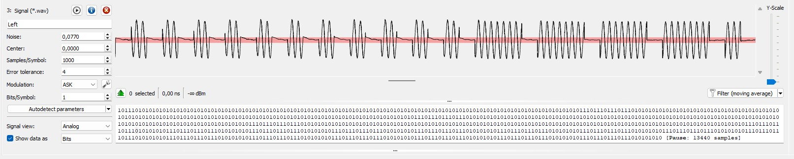
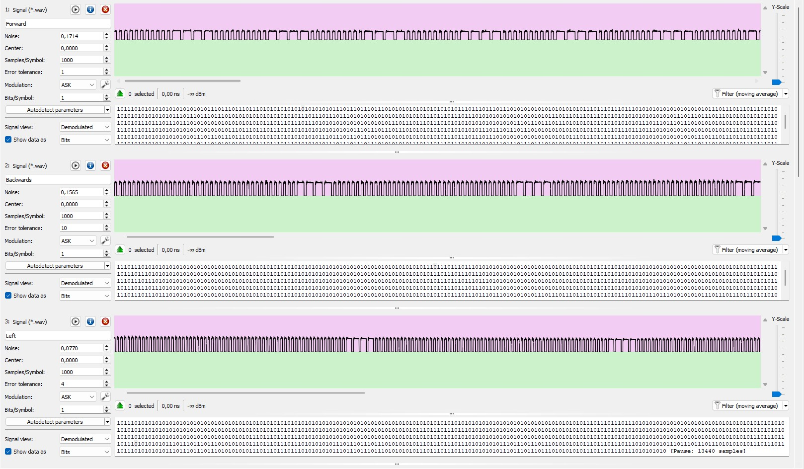
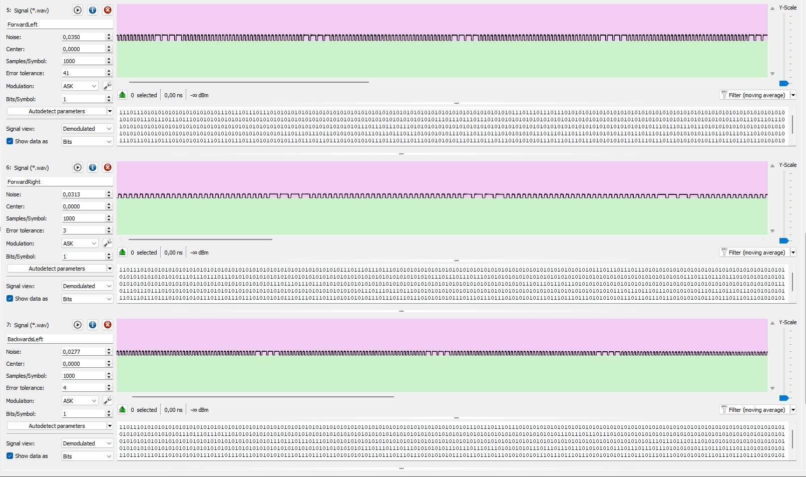
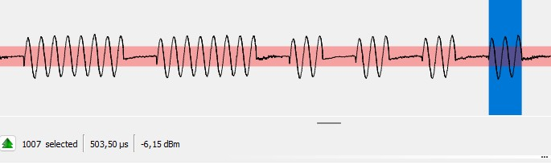

#  SDR RC Car Controller (HackRF & Python)

This project demonstrates taking control of a commercial RC vehicle (27 MHz) using a **HackRF One** and a graphical user interface developed in Python. 

Unlike traditional SDR scripts that introduce high execution latency, this application utilizes a permanently open **IPC (Inter-Process Communication)** channel and injects I/Q samples directly from RAM, achieving **zero-latency** keyboard control.

---

##  1. Protocol Reverse Engineering (Baseband Analysis)

To accurately reproduce the commands, I intercepted the original remote control signals and performed reverse engineering using **Universal Radio Hacker (URH)**.

### Modulation (Physical Layer)
Analog visualization of the raw signal, prior to applying the demodulation threshold. Time-domain analysis of the signal envelope clearly highlights the presence of **OOK (On-Off Keying)** modulation. It can be observed how information is transmitted by simply switching the RF carrier on and off.


*> Figure 1: Analog visualization, without prior demodulation. The presence of OOK modulation is observed following the time-domain analysis of the signal.*

### Data Extraction (Baseband Demodulation)
The system translates the presence of the carrier wave into a logical "High" state and its absence into a "Low" state. Below are the signals corresponding to the standard directions (Forward, Backwards, Left), demodulated and represented digitally in the baseband.


*> Figure 2: The signals for the standard directions, demodulated, in the baseband.*

The same technique was applied to the complex commands. This decoding confirms that the diagonal directions are not simple mathematical overlays of signals, but rather distinct data sequences transmitted by the remote control.


*> Figure 3: The signals of the diagonals demodulated in the baseband.*

### Data Encoding (Decoding the PWM Protocol)
Temporal analysis of the demodulated signal demonstrates the use of **PWM (Pulse Width Modulation)** encoding for transmitting logical information. The microcontroller differentiates the bits by measuring the duration of the active state:

<p align="center">
  
  &nbsp; &nbsp;
  
</p>

*> Figure 4 (Left): Width of a logical "1" pulse (approx. 503.50 µs). Figure 5 (Right): Width of a logical "0" pulse (approx. 510.00 µs).*

### Differential Analysis
Once the bits were extracted, I performed a differential analysis to isolate the structure of the data frames. 


*> Figure 6: Differential analysis in URH. The first columns represent the **Preamble (Sync Word)**, identical for all commands. The red-marked bits represent the pulse width variations (Payload) that dictate the movement direction to the H-bridges.*

---

## 2. Software Architecture & Design Decisions

The primary challenge of the project was **eliminating latency**. Launching a terminal command (`hackrf_transfer`) on every keystroke introduced a 100-200ms delay.

### The Solution: The "Data Pump" Architecture
I implemented a continuous streaming pipeline:
1. `hackrf_transfer` is launched only once as a subprocess in "read from STDIN" mode.
2. A dedicated Python thread continuously pumps data (at the strict rate of 4 MB/s) into this *OS Pipe*.
3. **When no key is pressed:** We inject arrays of zeros (transmitting a silent carrier wave).
4. **When a key is pressed:** The pointer instantly jumps to the RAM buffer containing the desired RF footprint.

### Advanced Technical Features:
* **RAM Pre-Caching:** All `.complex16s` files are loaded into RAM on startup to eliminate latency and micro-interruptions caused by disk reading (RF Jitter).
* **Wrap-Around Logic (Seamless Looping):** The algorithm dynamically recalculates the 64 KB chunks, allowing the signal to run in a perfect loop as long as the key is held down.
* **Deadlock Prevention (Stderr Polling):** A separate *Error Reader Thread* constantly drains the hardware's `stderr` channel to prevent OS buffer overflow and main process blocking.
* **Windows EOF Sanitization:** On Windows, a RAM filter sanitizes the binary payload by replacing the `0x1A` byte with `0x1B`, preventing the accidental triggering of an EOF (End of File) signal inside the STDIN pipe.

---

##  3. Running the Project

### Requirements
* Hardware: **HackRF One** and an RC vehicle (27 MHz)
* Software: Universal Radio Hacker,Python 3.x, `hackrf-tools` added to the system PATH.

### Installation and Usage
1. Clone the repository:
   ```bash
   git clone [https://github.com/username/sdr-rc-controller.git](https://github.com/username/sdr-rc-controller.git)
   cd sdr-rc-controller
