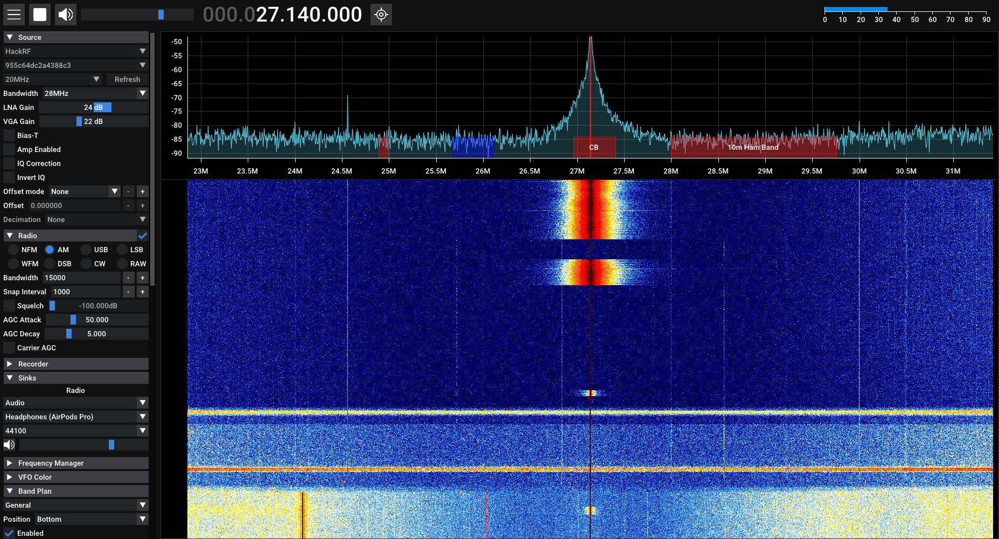
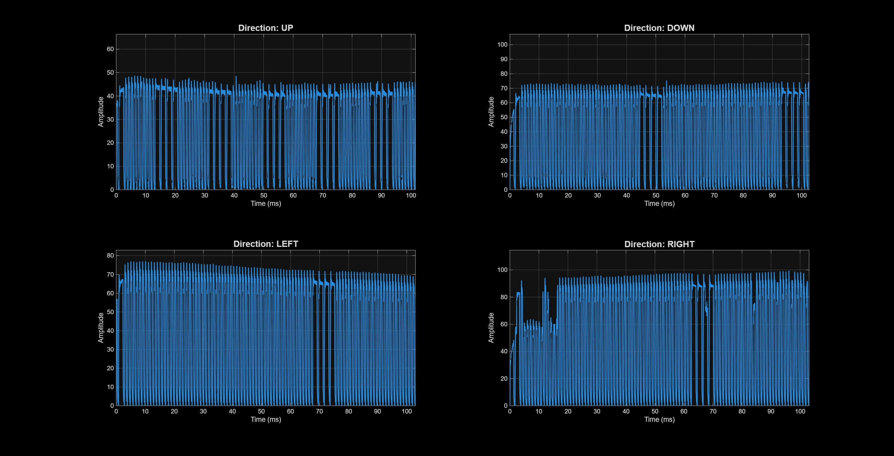
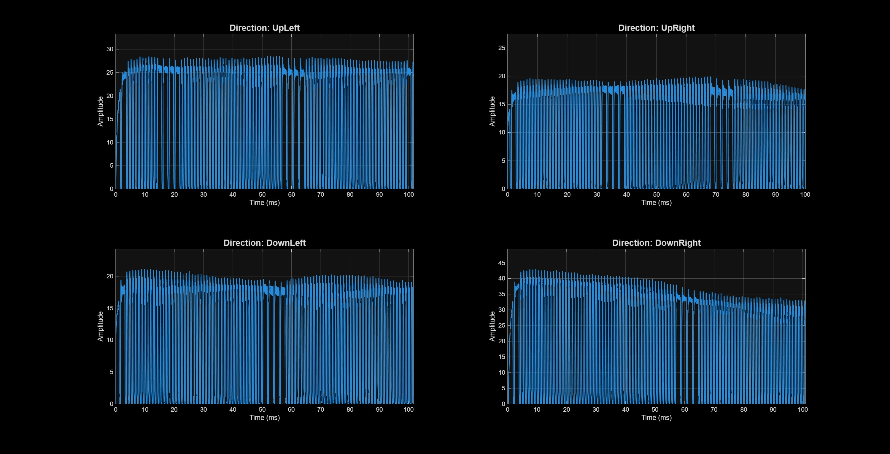
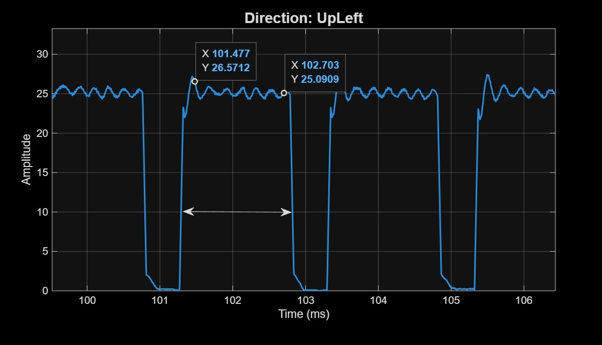
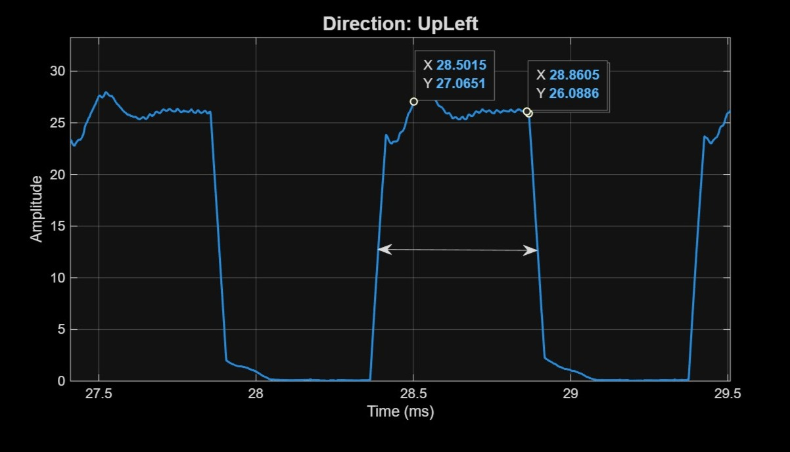
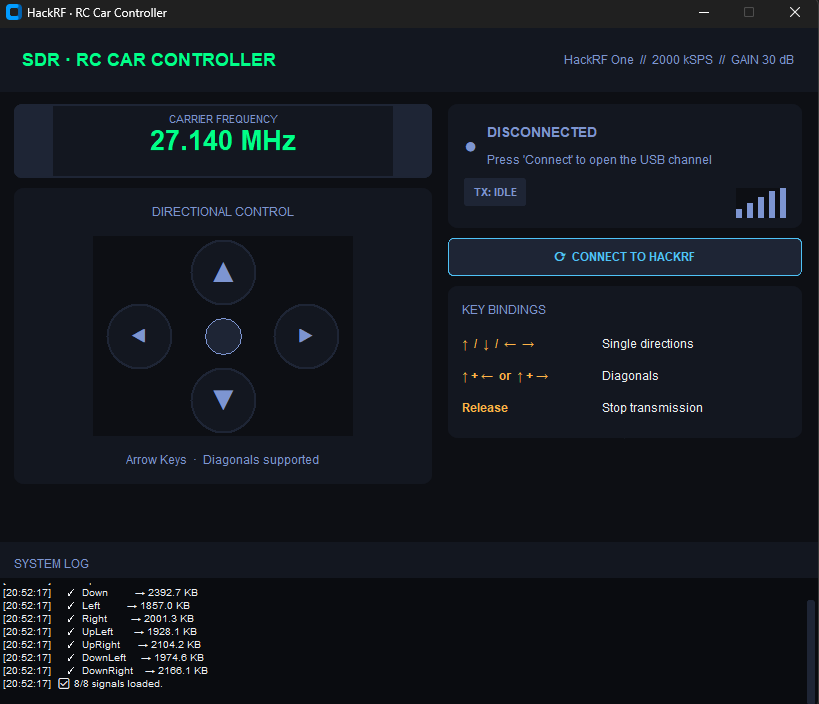

#  SDR RC Car Controller (HackRF & Python)

  &emsp; This project demonstrates taking control of a simple RC vehicle that operates on 27MHz using a **HackRF One** and a graphical user interface developed in Python. 

&emsp; Unlike traditional SDR scripts that introduce high execution latency, this application utilizes a permanently open **IPC (Inter-Process Communication)** channel and injects I/Q samples directly from RAM, achieving **zero-latency** keyboard control.

---

##  1. Protocol Reverse Engineering (Baseband Analysis)
&emsp; To accurately reproduce the commands, I first had to intercept the original remote control signals. To identify the exact operating frequency of the RC car, I used **SDR++**. Below is a screenshot of the RF spectrum and the configuration used to detect the correct carrier frequency.  

  
*> Figure 0: SDR++ waterfall and spectrum analyzer used for hunting the remote control's transmission frequency.*

&emsp; I performed the reverse engineering process using **Universal Radio Hacker (URH)** in order to demodulate and then do a replay attack on the RC car. The URH settings used to record the signal were as follows:  
Freq: 27.14Mhz      
Sample rate: 2.0Mhz      
BW: 2Mhz     
Gain:20    

### Modulation (Physical Layer)
&emsp; Analog visualization of the raw signal, prior to applying the demodulation threshold. Time-domain analysis of the signal envelope clearly highlights the presence of **OOK (On-Off Keying)** modulation. It can be observed how information is transmitted by simply switching the RF carrier on and off.

  
*> Figure 1: Analog visualization, without prior demodulation. The presence of OOK modulation is observed following the time-domain analysis of the signal.*

### Data Extraction (Baseband Demodulation)
&emsp; To mathematically validate the findings from the visual inspection in URH, the raw baseband signals (`.complex16s`) were imported into **MATLAB** for rigorous Digital Signal Processing (DSP). 
  The raw files contain interleaved 8-bit signed I/Q samples captured at a rate of 2 MSPS. The complex signal was reconstructed using the formula $S(t) = I(t) + jQ(t)$.

#### 1. Time-Domain Analysis & Envelope Extraction
  The raw magnitude of the complex RF signal is inherently noisy. To accurately observe the OOK/PWM pulses, a **Moving Average Low-Pass Filter** was applied to the signal's magnitude. This mathematical smoothing reveals the clean amplitude envelope, allowing for precise microsecond measurements of the duty cycles.


*> Figure 2: The signals for the standard directions, demodulated, in the baseband.*

&emsp; The same technique was applied to the complex commands. This decoding confirms that the diagonal directions are not simple mathematical overlays of signals, but rather distinct data sequences transmitted by the remote control.


*> Figure 3: The signals of the diagonals demodulated in the baseband.*

### Data Encoding (Decoding the PWM Protocol)
&emsp; Temporal analysis of the demodulated signal demonstrates the use of **PWM (Pulse Width Modulation)** encoding for transmitting logical information. The microcontroller differentiates the bits by measuring the duration of the active state:

<p align="center">
  
  &nbsp; &nbsp;
  
</p>

*> Figure 4 (Left): Width of a logical "1" pulse (approx. 1.226 ms). Figure 5 (Right): Width of a logical "0" pulse (approx. 0.36 ms = 360 µs).*

---

## 2. Software Architecture & Design Decisions

&emsp; The primary challenge of the project was **eliminating latency**. Launching a terminal command (`hackrf_transfer`) on every keystroke introduced a 100-200ms delay.

### The Solution: The "Data Pump" Architecture
I implemented a continuous streaming pipeline:
1. `hackrf_transfer` is launched only once as a subprocess in "read from STDIN" mode.
2. A dedicated Python thread continuously pumps data (at the strict rate of 4 MB/s) into this *OS Pipe*.
3. **When no key is pressed:** We inject arrays of zeros (transmitting a silent carrier wave).
4. **When a key is pressed:** The pointer instantly jumps to the RAM buffer containing the desired RF footprint.

### Technical Features:
* **RAM Pre-Caching:** All `.complex16s` files are loaded into RAM on startup to eliminate latency and micro-interruptions caused by disk reading (RF Jitter).
* **Wrap-Around Logic (Seamless Looping):** The algorithm dynamically recalculates the 64 KB chunks, allowing the signal to run in a perfect loop as long as the key is held down.
* **Deadlock Prevention (Stderr Polling):** A separate *Error Reader Thread* constantly drains the hardware's `stderr` channel to prevent OS buffer overflow and main process blocking.
* **Windows EOF Sanitization:** On Windows, a RAM filter sanitizes the binary payload by replacing the `0x1A` byte with `0x1B`, preventing the accidental triggering of an EOF (End of File) signal inside the STDIN pipe.

* ### 🖥️ Graphical User Interface (The Dashboard)
&emsp; The application features real-time graphical interface developed using `customtkinter`. This dashboard serves as the central command hub for the vehicle, providing a visual bridge between keyboard inputs and SDR hardware management.

  
*> Figure 7: The main application window showing a detailed view of the control interface.*

---

##  3. Running the Project

### Requirements
* Hardware: **HackRF One** and a RC vehicle (27 MHz)
* Software: **Universal Radio Hacker**, **SDR++/SDR#**, or any other SDR software, `Python 3.x`, `hackrf-tools` added to the system PATH.
* Note: The application might not start directly from a standard Python terminal. If attempted, the execution will fail with the error: `hackrf_transfer not found. Install **hackrf-tools**...` To run the app correctly, I recommend installing `Radioconda`. `Radioconda` will automatically set up the environment and install all the necessary system utilities for HackRF (including `hackrf_transfer`).The error happens because the Python app is trying to execute a system command (`hackrf_transfer`), which is a separate executable, not a **Python** library installed via `pip`. A standard **Python** environment doesn't have this command in its PATH, whereas `Radioconda` (a specialized SDR distribution) installs these tools so the script can easily access them."

 ## 4. Demo
You can see the live demonstration of the car working by clicking the link below:  
[▶️ Click here for the live demo](https://youtube.com/shorts/5lvyyr6I2Y8?feature=share)

### Installation and Usage
1. Clone the repository:
   ```bash
   git clone [https://github.com/username/sdr-rc-controller.git](https://github.com/username/sdr-rc-controller.git)
   cd sdr-rc-controller
